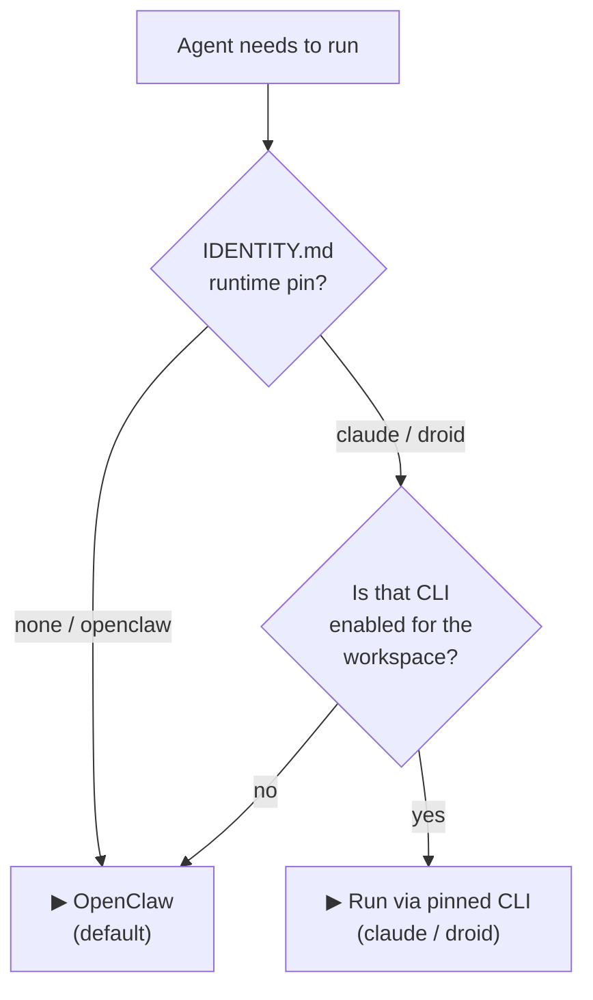
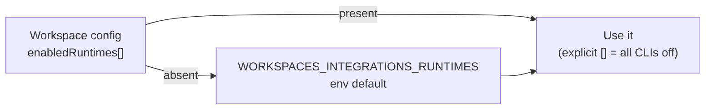
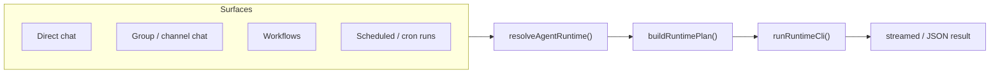

# 🤖 Agent Runtimes

**Feature branch:** `feature/agent-runtimes`

This branch lets a ClawMax agent execute through the **Claude Code** (`claude`) or **Factory Droid** (`droid`) CLI instead of **OpenClaw** — chosen per workspace and pinned per agent, applied identically across every execution surface (direct chat, group/channel chat, workflows, and scheduled/cron runs). OpenClaw stays the default and every existing OpenClaw call site is untouched; this branch adds a runtime **adapter** that centralizes *which* CLI runs an agent and owns the spawn plan for the two new CLIs.

This document covers **only the changes on this branch**. For everything else about ClawMax, see the main [`README.md`](README.md).

---

## ✨ What this branch adds

| Capability | Summary |
|---|---|
| **Two new agent runtimes** | Agents can run on Claude Code or Factory Droid, not just OpenClaw. |
| **Multi-select enablement** | Enable Claude Code and/or Factory Droid independently for a workspace (BYOK → Models → *Run via CLI*). Enabling one does not disable the other. |
| **Per-agent runtime pin** | Each agent can be pinned to a runtime in the agent editor; the pin lives in the agent's `IDENTITY.md`, never in `openclaw.json`. |
| **Consistent resolution everywhere** | Direct chat, channels/groups, workflows, and cron all resolve an agent's runtime the same way through one adapter. |
| **Headless, full-autonomy execution** | `claude --dangerously-skip-permissions` and `droid --auto high`, authenticated via API keys with no interactive prompt. |
| **Ships on every deployment path** | Docker image (version-pinned + checksum-verified CLIs), `setup.sh`/`doctor.sh` non-fatal detection, `.env.example`/README/SETUP docs. |

---

## 🧭 How runtime resolution works

An agent's runtime is resolved from two inputs: the **per-agent pin** (from `IDENTITY.md`) and the **workspace's enabled CLIs**. A pin is honored *only if that CLI is enabled*; otherwise the agent falls back to OpenClaw. This is deliberate — disabling a CLI at the workspace level instantly and safely reverts every agent pinned to it, with no per-agent cleanup.



**Enabled-CLI resolution** (`resolveEnabledRuntimes()`), highest precedence first:



The env default mirrors the existing `WORKSPACES_INTEGRATIONS_THIRD_PARTIES` partner pattern: a workspace's own selection always wins, and the env value only supplies the default when the workspace has never configured runtimes.

---

## 🎛️ Selecting a runtime

### Enable the CLIs (workspace level)

**BYOK → Models → “Run via CLI — enable the CLIs you want”** shows Claude Code and Factory Droid as multi-select toggles, each with a live detection chip (`detected 2.1.205` or `not installed` + an install hint). Toggling is independent — enable neither, either, or both. Enabling a CLI only makes it *available*; it doesn't move any agent onto it.

Equivalent programmatic control:

| Method | How |
|---|---|
| **UI** | BYOK → Models → *Run via CLI* checkboxes |
| **API** | `PUT /api/integrations/config` with `enabledRuntimes: ["claude","droid"]` (explicit `[]` = all CLIs off) |
| **Env default** | `WORKSPACES_INTEGRATIONS_RUNTIMES=claude,droid` (deployment default; workspace config overrides) |

`GET /api/integrations/runtimes` returns `{ runtimes, workspaceDefault, enabledRuntimes }`, where `enabledRuntimes` is the **resolved** set (config-or-env). The client reads this so its checkboxes and its save value reflect the env default and never clobber it with a blind `[]`.

### Pin an agent (per agent)

The agent editor's **Runtime** field offers *Default / OpenClaw / Claude Code / Droid*, filtered to the currently-enabled CLIs (a pin to a now-disabled CLI is shown but flagged). The pin is stored in the agent's `IDENTITY.md` (`- **Runtime:** claude`), so switching an agent's runtime never touches its OpenClaw session state.

---

## 🔌 The three runtimes

| Runtime | CLI | Auth | Model notation | Session continuity |
|---|---|---|---|---|
| **OpenClaw** (default) | `openclaw` | ClawMax's normal key resolution (BYOK / system keys) | `<provider>/<model>` | OpenClaw's own session store |
| **Claude Code** | `claude` | `ANTHROPIC_API_KEY` (or `claude login`) | **Anthropic only** — `anthropic/<model>` | deterministic session UUID, `cwd`-scoped resume |
| **Factory Droid** | `droid` | `FACTORY_API_KEY` (or `droid login`) | any provider/model Droid supports (provider prefix stripped) | deterministic 48-char session id |

**Spawn plans** (built by `buildRuntimePlan()`, spawned argv-array with no shell):

```text
claude  -p <message> --model <anthropic-model> (--session-id | --resume) <uuid>
        --dangerously-skip-permissions [--append-system-prompt <IDENTITY>] [--output-format json]
        (cwd = agent dir — claude resume is cwd-scoped)

droid   exec <message> [-m <model>] -s <session-id> --auto high -o json --cwd <agent-dir>
        [--append-system-prompt <IDENTITY>]
```

**Model guardrail:** a Claude-pinned agent must use an `anthropic/*` model — any other provider raises a `RuntimeModelError` with an actionable message rather than silently mis-running. Droid accepts any model and strips the `<provider>/` prefix.

**Session determinism:** `claudeSessionUuid()` / `droidSessionId()` hash `agentId + scopedSessionId`, so two agents sharing a raw session key (e.g. a DM) can never collide on the same underlying CLI session. Claude runs self-heal: a `not-found` session error retries as a fresh session, an `already-in-use` error retries as `--resume`.

---

## 🔑 Auth & CLI discovery

Both CLIs run non-interactively with full autonomy, so they need credentials already in place before an agent turn starts. There are two independent ways to supply them, and **neither requires an API key** — a CLI subscription login works on its own.

### Option A — log the CLI in (no API key)

Each CLI stores its login in its own config directory under `HOME` (`/app` in this image): `claude` → `/app/.claude`, `droid` → `/app/.factory`. Persist those directories and the login survives container recreation. `docker-compose.yml` mounts both by default (named volumes), and either can be pointed at a host directory:

```bash
# reuse a droid login you already have on the host
CLAWMAX_FACTORY_DIR=~/.factory docker compose up -d

# keep the claude login in a host directory of your choosing
CLAWMAX_CLAUDE_DIR=~/.clawmax/claude docker compose up -d
```

Then log in against the mounted directory, once:

```bash
docker compose exec clawmax claude auth login   # --claudeai (subscription) is the default
docker compose exec clawmax claude auth status  # expect: "loggedIn": true
docker compose exec -it clawmax droid           # then /login
```

`claude setup-token` is the non-interactive alternative for a Claude subscription.

> **macOS note:** Claude Code stores its *host* login in the macOS Keychain, not on disk, so there is nothing to bind-mount from a host `claude login`. Log in against the mounted directory instead — inside the Linux container the CLI falls back to a file, which is what makes the mount work. Droid keeps its credentials in files (`~/.factory/auth.v2.*`) on both platforms, so its host login can be mounted directly.
>
> Mount the container's config dir **read-write**. Droid writes session and background-task state on every run, so a read-only mount authenticates but then fails mid-turn.

### Option B — headless API keys

- **Claude Code** reads `ANTHROPIC_API_KEY` directly — `SYSTEM_ANTHROPIC_API_KEY` / `USER_ANTHROPIC_API_KEY` / in-app BYOK all resolve into it for agent execution (subject to the existing Separated Key Policy).
- **Factory Droid** reads `FACTORY_API_KEY` (passed through by `safeEnv()`).

A key and a login are interchangeable; supply either. Use keys for CI and unattended deploys, a login for a subscription you already pay for.

**CLI path discovery** (`resolveRuntimeCliPath()`), in order: `CLAUDE_BIN` / `DROID_BIN` env override → `which <cli>` on `PATH` → `~/.local/bin/<cli>`.

---

## 🖥️ Execution surfaces

Every surface that runs an agent resolves the runtime through the same adapter — there is no surface where a pin is silently ignored:



OpenClaw intentionally keeps its existing inline spawn path; the adapter centralizes *resolution* for OpenClaw and owns the *full* spawn+execute path for `claude`/`droid`.

---

## 🐳 Deployment

The image bakes in both optional CLIs, version-pinned for reproducible builds:

| CLI | Pin | Install mechanism |
|---|---|---|
| Claude Code | `ARG CLAUDE_CODE_VERSION=2.1.205` | `npm install -g @anthropic-ai/claude-code@<version>` |
| Factory Droid | `ARG FACTORY_DROID_VERSION=0.158.0` | download the versioned artifact, **verify its `.sha256`**, install to `~/.local/bin/droid`, then assert `droid --version` matches — build fails otherwise |

Droid isn't on npm and its public installer hardcodes a version with no override, so the Dockerfile downloads the same artifact the installer would (`downloads.factory.ai/factory-cli/releases/<version>/linux/<arch>/droid`), picking `x64`/`arm64` and an AVX2 `-baseline` variant as needed, and checksum-verifies it.

**Container-as-root handling:** the image runs as root, and Claude Code refuses `--dangerously-skip-permissions` as root unless a sandbox is signalled. `runRuntimeCli()` injects `IS_SANDBOX=1` **only** for `claude` spawns **only** when `process.getuid() === 0`, so the flag is accepted in-container without affecting non-root or droid runs.

**Non-Docker installs:** `./setup.sh` and `./SYSTEM/doctor.sh` report each CLI's detected version but never auto-install — a missing CLI is a non-fatal `warn` with a fix hint, since both runtimes are optional.

---

## ⚙️ Config & env vars

```env
# Deployment default for which CLI runtimes are enabled (workspace config overrides).
# Mirrors WORKSPACES_INTEGRATIONS_THIRD_PARTIES.
WORKSPACES_INTEGRATIONS_RUNTIMES=claude,droid

# Auth (headless)
ANTHROPIC_API_KEY=sk-ant-...      # Claude Code
FACTORY_API_KEY=fk-...            # Factory Droid

# Optional CLI path overrides (default: `which <cli>`, then ~/.local/bin/<cli>)
CLAUDE_BIN=/path/to/claude
DROID_BIN=/path/to/droid
```

| Variable | Purpose |
|---|---|
| `WORKSPACES_INTEGRATIONS_RUNTIMES` | Comma-separated default enabled CLIs (`claude,droid`). Deployment default only. |
| `ANTHROPIC_API_KEY` | Claude Code auth (also resolved from SYSTEM/USER/BYOK keys). |
| `FACTORY_API_KEY` | Factory Droid auth. |
| `CLAUDE_BIN` / `DROID_BIN` | Explicit CLI executable path override. |

---

## 📁 What changed

```
Runtime adapter (server)
├── server/lib/agent-runtime.ts            # resolution, spawn plan, executor, session-id hashing, model guardrail
├── server/lib/runtime-sessions.ts         # per-agent CLI session-id persistence (markRuntimeSession)
├── server/lib/runtime-transcripts.ts      # parse claude/droid transcripts back into chat history
├── server/lib/agent-model.ts              # model-notation resolution for runtimes
├── server/lib/workspace-integrations.ts   # enabledRuntimes config field + normalize
├── server/lib/prereqs.ts                  # CLI detection prereq checks
└── server/lib/safe-env.ts                 # FACTORY_API_KEY passthrough

Execution surfaces (server routes)
├── server/routes/chat.ts                  # direct chat → adapter
├── server/routes/channels.ts              # group/channel chat → adapter
├── server/lib/workflows.ts                # workflow steps → adapter
├── server/routes/agents.ts                # per-agent runtime pin (IDENTITY.md read/write)
├── server/lib/agent-execution.ts          # shared execution wiring
└── server/routes/integrations.ts          # GET /runtimes, PUT /config allow-list

Client
├── client/src/components/ByokWizard.tsx   # "Run via CLI" multi-select + Runtime tab
├── client/src/pages/Agents.tsx            # per-agent Runtime dropdown (filtered to enabled CLIs)
├── client/src/lib/agentRuntimeReload.ts   # in-flight reload guard (don't clobber a live edit)
├── client/src/lib/runtimeStatusesLoading.ts
└── client/src/App.tsx

Deployment & tooling
├── Dockerfile                             # pinned + checksum-verified claude/droid installs
├── docker-entrypoint.sh                   # runtime env wiring
├── docker-compose.yml                     # ANTHROPIC_API_KEY / FACTORY_API_KEY passthrough
├── setup.sh, SYSTEM/doctor.sh             # non-fatal CLI detection
└── SYSTEM/dashboard/.env.example          # documented env contract
```

---

## ✅ Tests

New behavior-level tests accompany the feature (bespoke `ts-node` assert style, run via `SYSTEM/test.sh`):

| Test | Covers |
|---|---|
| `agent-runtime.test.ts` | resolution (pin-honored-only-if-enabled, unpinned→openclaw), spawn plans, model guardrail, session-id determinism, root/`IS_SANDBOX` logic, claude session self-heal |
| `runtime-sessions.test.ts` | session-id persistence |
| `runtime-transcripts.test.ts` | transcript parsing |
| `agent-model.test.ts` | model-notation resolution |
| `integrations.test.ts` | `/runtimes` resolution + `PUT /config` allow-list |
| `agents.test.ts` | per-agent pin read/write |
| `channels.test.ts`, `chat.test.ts`, `chat-route-edges.test.ts`, `workflows.test.ts` | per-surface runtime routing |
| `agentRuntimeReload.test.ts`, `runtimeStatusesLoading.test.ts` | client reload-guard + status loading |

---

## 🧩 Design notes

- **Adapter, not a rewrite.** OpenClaw's spawn call sites are unchanged. The adapter centralizes *resolution* for all three runtimes and owns the *full* spawn+execute path for `claude`/`droid` only.
- **Disable is the kill switch.** Because a pin is honored only when its CLI is enabled, turning a CLI off at the workspace level reverts every agent pinned to it to OpenClaw — no per-agent edits.
- **OpenClaw-only features.** The Gateway (WebSocket skills/tools, Gateway Control pairing), `openclaw logs` streaming, and `openclaw cron` registration stay OpenClaw-specific — Claude Code/Droid have no equivalent. Agents pinned to `claude`/`droid` still run on schedule via ClawMax's in-process scheduler; they're just not additionally registered with `openclaw cron`.
